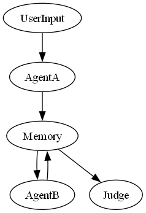

# 🧠 Multi-Agent Debate DAG using LangGraph 

This project simulates a structured debate between two AI agents — a **Scientist** and a **Philosopher** — over a user-defined topic. The system is designed following LangGraph-inspired architecture with memory, turn control, and an automated Judge node that evaluates the debate using logical metrics. All arguments and judgments are generated **dynamically using a local Hugging Face model (Qwen‑1.5‑0.5B)**. No internet or API keys are required after setup.

---

## 📌 Features

- 🔁 **8-Round Debate**: 4 turns each between Scientist and Philosopher
- 🧠 **Memory Node**: Tracks and summarizes previous arguments
- ⏱ **Turn Control**: Enforces alternation and prevents argument repetition
- ⚖️ **Judge Node**: Evaluates both agents on 5 criteria:
  - Logical coherence
  - Evidence/facts
  - Relevance to topic
  - Persuasive strength
  - Rebuttal quality
- 📝 **Logging**: Full transcript and judgment saved to debate_log.txt
- 🧮 **DAG Visualization**: Automatically generates a dag_diagram.png

---

## 🗂️ Folder Structure

```
multi-agent-debate-dag/
├── agents/             # Agent A (Scientist), Agent B (Philosopher), Judge logic
├── nodes/              # Memory, logger, state validator, user input
├── dag/                # Core debate flow (LangGraph-like DAG)
├── utils/              # Model downloader, DAG diagram visualizer
├── main.py             # CLI entry point
├── requirements.txt    # Python dependencies
├── debate_log.txt      # Generated during runtime
├── dag_diagram.png     # DAG architecture diagram
└── README.md           # You are here
```

---

## 🚀 How to Run

### ✅ 1. Install dependencies
```bash
pip install -r requirements.txt
```

### ✅ 2. Download the model (Qwen 0.5B)
```bash
python utils/download_qwen.py
```

### ✅ 3. Run the app
```bash
python main.py
```

### 💬 Example
```text
Enter topic for debate: Is lying a sin?

[Round 1] Scientist: Lying disrupts social trust and impairs rational decision-making.
[Round 2] Philosopher: From a Kantian lens, lying undermines moral duty and human dignity.
...
[Judge] Winner: Philosopher
Reason: Because Philosopher offered more consistent, well-articulated arguments throughout the discussion.
```

---

## 📊 DAG Diagram

Generated automatically on each run:



---

## 📄 Log File

Each run saves a full transcript and verdict to `debate_log.txt`.

---

## 🤖 Model Details

- **Model**: `Qwen/Qwen1.5-0.5B`
- **Context**: Up to ~2k tokens
- **Fully offline** after download
- **No OpenAI or API key required**
